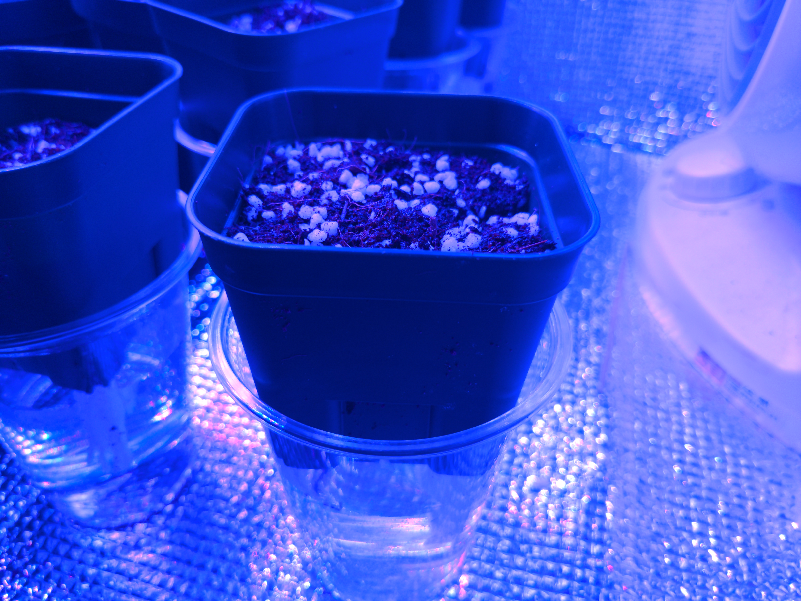

# sonic_method
Super Easy Semi-Hydroponic Hack with Love.

## Requirment

- plastic cup x 1
- small plastic pot x 1
- seed x 1
- soil (coco 1:1 perlite is highly recommended)
- water
- root enhancer (nice to have)
- wet tissue
- SUN or LED

## How to install

- thread a wet tissue through holes in a bottom of a small pot
- fill it with soil
- plant a seed
- install the pot to a 1/2 cup of water
- add water if the wet tissue gets dry. that's it!

## How to become a hacker

- enjoy your life
- a bigger pot helps a big harvest
- root enhancer is effective but expensive
- submit a pull request
